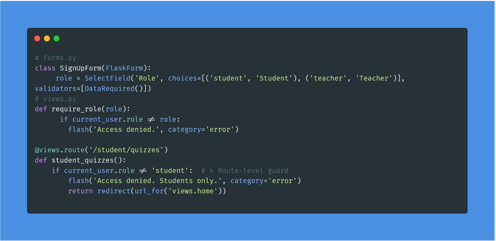
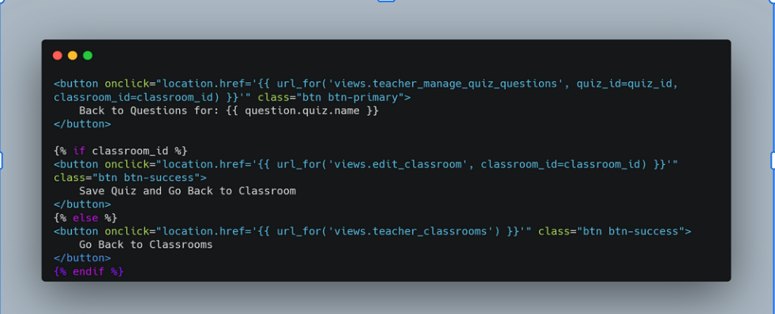
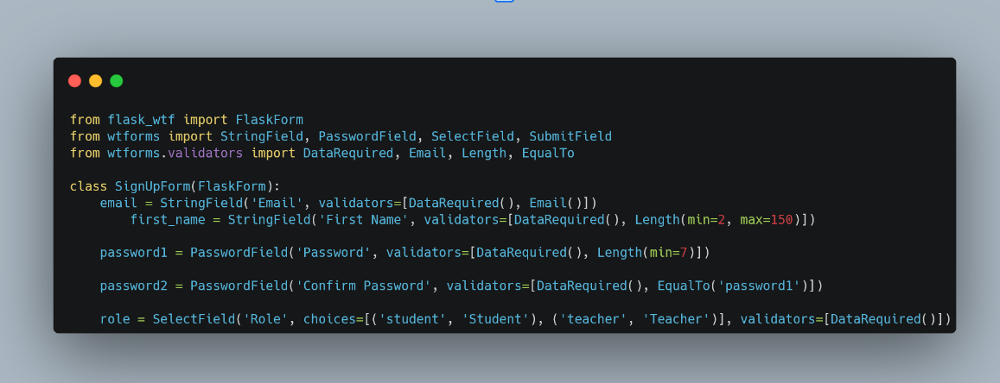

{: .no_toc }
# Design Decisions

{: .text-delta }

Table of contents

+ ToC
{: toc }

## Table of Contents
01: Web Application Framework Selection - Flask with Jinja2
02: Database Architecture - SQLite with SQLAlchemy
03: Frontend Architecture - Bootstrap with Jinja2

## 01: Web Application Framework Selection - Flask with Jinja2

### Meta
**Status**: Decided  
**Updated**: 20-06-2025

### Problem Statement
We needed to choose a web application framework that would allow us to:
- Create an interactive quiz platform
- Handle user authentication and sessions
- Manage database operations efficiently
- Support template-based rendering
- Maintain easy testability and deployment
- Enable rapid development with a small team

### Decision
We have decided to use Flask as our web framework with Jinja2 templating engine, SQLite database, and Python backend. This decision was made based on the following requirements:
- Need for a lightweight yet powerful web framework
- Simple integration with SQLite for data persistence
- Built-in template engine for dynamic HTML rendering
- Strong Python ecosystem for educational applications
- Easy learning curve for team members

## 02: Database Architecture - SQLite with SQLAlchemy

### Meta
**Status**: Decided  
**Updated**: 20-06-2025

### Problem Statement
For the quiz platform, we needed a database structure that:
- Manages user profiles and authentication
- Stores quiz content and results
- Enables classroom management
- Supports shop system and points management
- Is easy to maintain and scale

### Decision
We chose SQLite with SQLAlchemy ORM, with the following structure:
- Normalized database structure with foreign key relationships
- Efficient indexing of frequently queried fields
- Cascading deletion for dependent records
- Transaction integrity for critical operations

### Rationale
- Perfect for medium-sized applications
- Easy integration with Flask
- No separate database installation required
- Robust ORM functionality through SQLAlchemy
- Simple backup and migration

## 03: Frontend Architecture - Bootstrap with Jinja2

### Meta
**Status**: Decided  
**Updated**: 20-06-2025

### Problem Statement
The user interface needed to:
- Be responsive and user-friendly
- Provide consistent design
- Enable dynamic quiz interactions
- Ensure easy navigation
- Support gamification elements

### Decision
Implementation of a frontend architecture based on:
- Bootstrap for responsive design
- Jinja2 templates for dynamic HTML generation
- Client-side validation
- Modular CSS system for various components

## 3 Example Design Decisions (from the presentation)

## 1 Problem
### Problem Statement
How do we implement RBAC so teachers can manage quizzes and students only access assigned ones?

### Decision
We implemented a simple role-based system with roles stored in the database.

### Communication
- The `role` field in the User model determines if a user is a teacher or student.
- Route-level guards and decorators restrict access to quiz management features for teachers and quiz participation for students.

### Implementation

## 2 Problem
### Problem Statement
How can teachers navigate in the quiz creation process?

### Decision
Implement contextual navigation to streamline the quiz creation workflow.

### Communication
Teachers need to move quickly and intuitively between different creation levels (e.g., quiz overview, adding questions, assigning to classrooms).

### Implementation

## 3 Problem
### Problem Statement
How should form validation be handled?

### Decision
Implement server-side validation using Flask-WTF.

### Communication
- Shows users form validation errors directly on the page.
- Ensures data integrity and security by validating all input on the server side.

### Implementation

