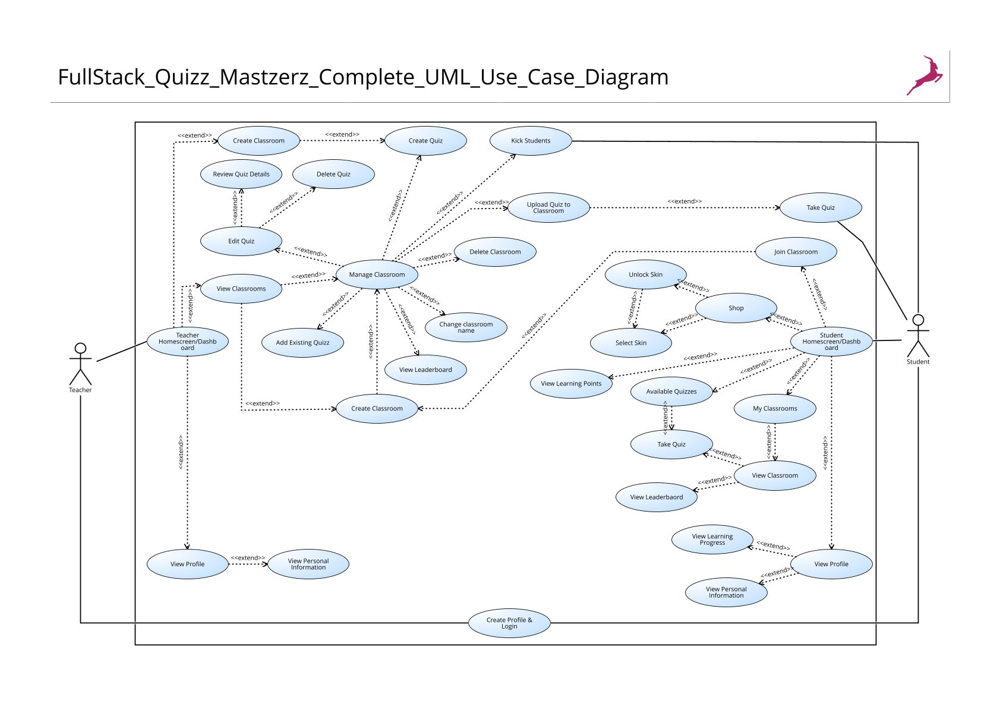

{: .no_toc }
# Data Model

{: .text-delta }

Table of contents

+ ToC
{: toc }

## Database Schema

 **UML Use Case Diagrams**

*Simplified UML Use Case Diagram showing the main system interactions.*

*Complete UML Use Case Diagram with detailed system architecture and relationships.*

- [UML Use Case Diagram - Simplified](../assets/pdfs/FullStack_Quizz_Masterz_UML_Use_Case_Diagramm_simplified.pdf)
- [UML Use Case Diagram - Complete](../assets/pdfs/FullStack_Quizz_Mastzerz_Complete_UML_Use_Case_Diagram.pdf)

## Authentication & User Management

*User login interface with email and password authentication.*

*Registration form for new users to create accounts.*

*Confirmation screen after successful user authentication.*

*Student profile displaying learning points, level, and personal statistics.*

## Classroom Management

*Overview of all classrooms a student has joined.*

*Interface for students to join classrooms using unique codes.*

*Individual classroom view showing assigned quizzes and class information.*

## Quiz System

*List of quizzes available for students to take in their classrooms.*

*Quiz interface where students answer questions and earn learning points.*

## Gamification Features

*Shop system where students can purchase cosmetic skins using earned points.*

## System Architecture

*Overall dashboard wireframe showing the complete application structure.*
