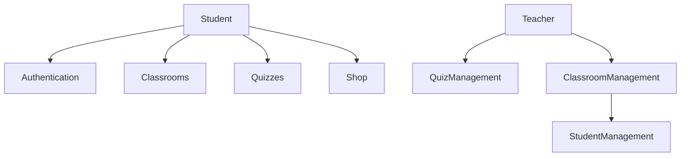

# QuizMasterz UI Components

The QuizMasterz application features a student and teacher-friendly interface with various UI components designed for both Users. Here's an overview:

## Key Interfaces

### Student Interface

### Authentication Screens

## Student Features

### Classroom Management

### Quiz Taking Interface

### Student Profile & Shop

## System Architecture

### UML Diagrams

For a complete understanding of our system architecture, refer to our detailed UML diagrams:

{: .download }
> For more detailed technical documentation, check our [architecture documentation](technical-docs/architecture.md) section.