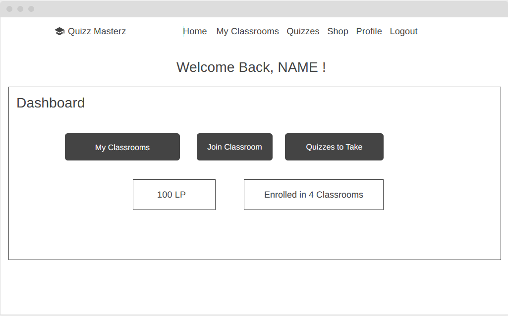

# QuizMasterz UI Components

The QuizMasterz application features a modern, user-friendly interface with various UI components designed for both students and teachers. Here's an overview of our main UI components and their usage.

## Key Interfaces

### Student Interface

```markdown

```


### Authentication Screens

```markdown

```


```markdown

```


## Student Features

### Classroom Management
{: .info }
> Students can join classrooms and view their enrolled classes through an intuitive interface.


### Quiz Taking Interface
{: .tip }
> Students can access available quizzes and take them in an interactive environment.


### Student Profile & Shop
{: .attention }
> Students can manage their profile and use the shop feature to enhance their learning experience.


## System Architecture

### UML Diagrams


For a complete understanding of our system architecture, refer to our detailed UML diagrams:


{: .download }
> For more detailed technical documentation, check our [architecture documentation](technical-docs/architecture.md) section.